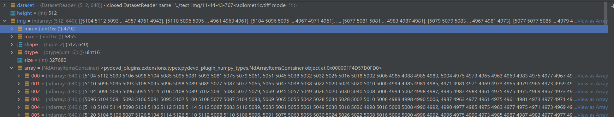
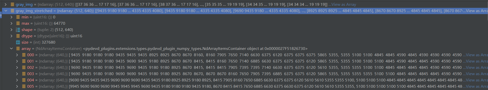
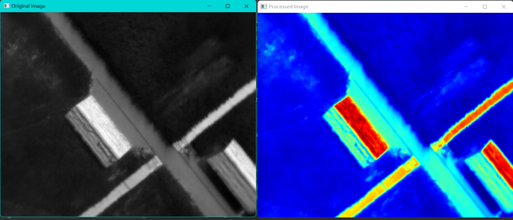

tiff大概率存的是热成像图的灰度图形式，而热成像的rgb图大概率只是用来可视化的

## 关于tiff的显示问题
直接看tiff图很白，可能是因为tiff的像素值范围是0到65535，而显示只能显示0到255，读取tiff后将像素值范围压缩到0到255显示就正常了
**这是tiff中像素值分布：**

**这是自己用伪色彩热成像图像转化成灰度图并拉伸后的图像的像素值分布情况：**

自己生成的tiff看起来就很正常

`结论是：数据集中的tiff图像对比度没拉开，像素值范围是0到65535而图像内像素值只在4000到7000有分布`

## tiff转换成rgb是这样的：

